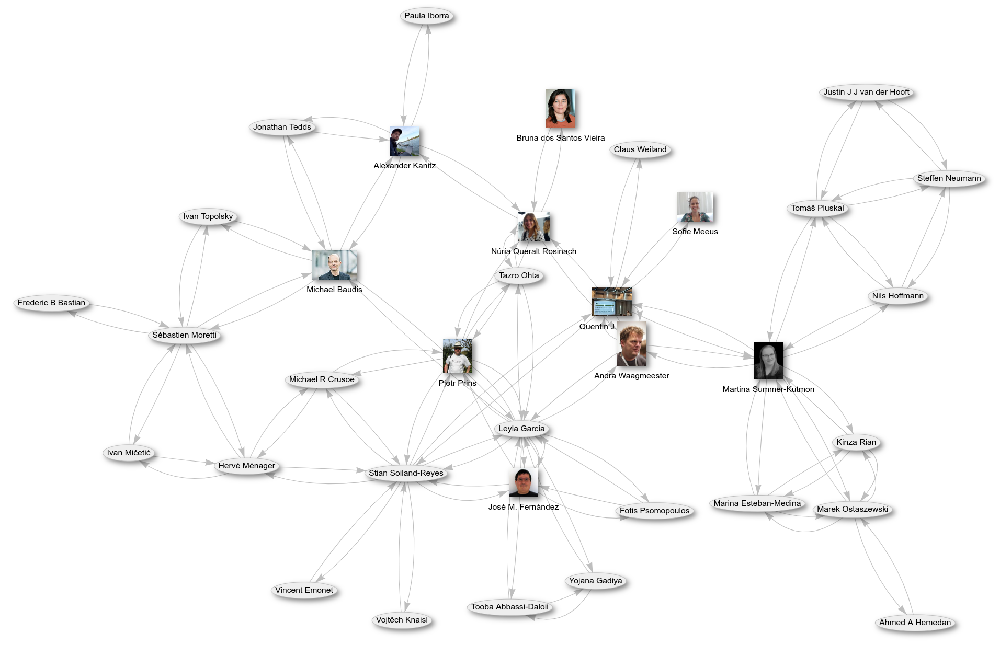
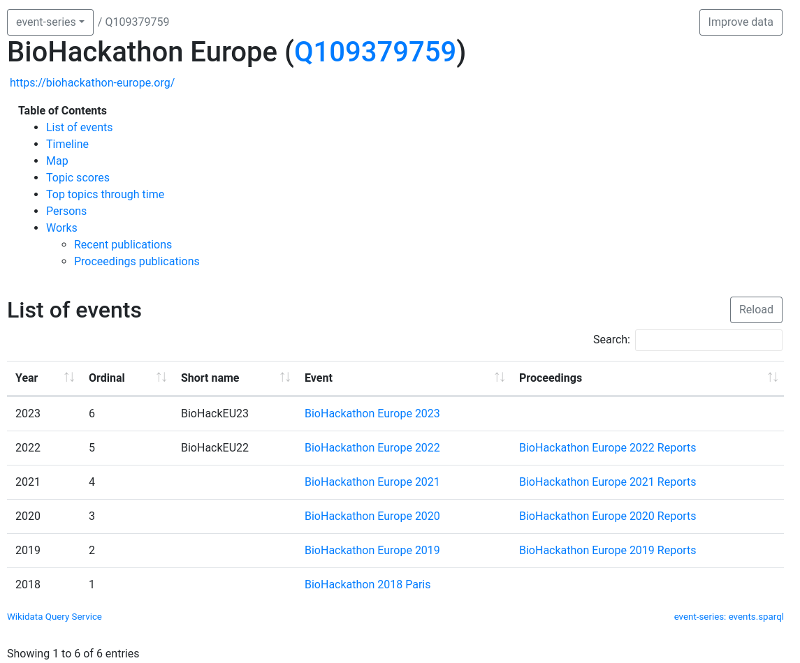

# Introduction
Wikidata is the linked-open-data graph of the Wikimedia foundation with its most known sibling Wikipedia
[@usesDataFrom:usesMethodIn:Vrandecic2012Wikidata]. What Wikipedia
is to text, Wikidata is to data. Like in Wikipedia linked-data can be added for everyone, by everyone. This makes Wikidata
a very rich source of data.

A substantial part of the data on Wikidata is about scientific publications and the authors of these
publications [@citesAsAuthority:Taraborelli2016WikiCite]. Scholia
is a tool that uses this data to create a profile page for authors and publications [@usesMethodIn:Nielsen2017Scholia]. 
This report describes a workflow to create co-author graphs using the data from Scholia. 

# Workflow
Figure 1 shows an example of a co-participation graph of this edition of the
[BioHackathon Europe 2023](https://github.com/elixir-europe/biohackathon-projects-2023) at the time of writing 
of this report. The graph is created using data from Wikidata, which is used by Scholia to create the profile pages of the individual
participants and the overall event page. 

This graph currently lists only the participants that have a Wikidata item, list their participation in this
BioHackathon, and have co-authors are least one article with another participant.

The following steps can be taken to add a participant to this graph:

1. First, check if the author is already known to Wikidata. Use one of the following patterns:
   * [https://scholar.toolforge.org/orcid/0000-0001-9773-4008](https://scholar.toolforge.org/orcid/0000-0001-9773-4008)
   * [https://scholar.toolforge.org/github/egonw](https://scholar.toolforge.org/github/egonw)
   * Or just search by name and check the details for the person (see also the *Author Disambiguator* below). You can use the ORCID profile as method to triage if you have the right person.
2. If missing, create a Wikidata item for the participant. This requires an ORCID. If not, [create a new Wikidata item](https://www.wikidata.org/wiki/Special:NewItem). Add as much information as you can, but at least the following statements:add your ORCID and name.
   1. Add a statement that you are a person. This can be done by adding the following statement: instance of (`P31`) human (`Q5`).
   2. Add a statement that you have an ORCID. This can be done by adding the following statement: ORCID iD (`P496`) and your ORCID.
   3. Complete the header of the Wikidata item with your name and provide a very short description of yourself (e.g. biocurator, data steward).
   4. (optional) Complete the header of the Wikidata item in multiple languages. 
3. (Optional) Upload a photo of yourself to [Wikimedia Commons](https://commons.wikimedia.org/wiki/Special:UploadWizard). This needs to be a photo of which you own the rights to share. 
   1. After you have done this, add this new Wikimedia Commons page as `image` to the Wikidata item for the author
4. Add the following statements to Wikidata item:
   1. Add a statement that you are a participant of the *BioHackathon Europe 2023*. This can be done by adding the following statement: *BioHackathon Europe 2023* (`Q118733318`) (or other event item). Navigate to the [participant statement](https://www.wikidata.org/wiki/Q118733318#P710) (P710). And add yourself, either by typing your name using autocompletion or add the Wikidata identifier of the Wikdata item that represents your profile.
   2. (optional) Add a statement that points to your photo on Wikimedia Commons. This can be done by adding the following statement: image (`P18`) and the identifier of the image on Wikimedia Commons.
5. (Optional) The author's Scholia page has a *Improve data* button in the top right. Click it.
   1. The *Author name strings to be resolved* section uses the [Author Disambiguator](https://scholia.toolforge.org/topic/Q76693569) to link more literature in Wikidata to the author's Wikidata item.
   2. the *Authored works with missing topics* section shows literature in Wikidata without `main subject` annotation. This is a more powerful keyword annotation. See the [Use Scholia and Wikidata to find scientific literature](https://laurendupuis.github.io/Scholia_tutorial/) tutorial for more information about that.

Navigate to the [BioHackathon Europe 2023](https://scholia.toolforge.org/event/Q118733318) page on Scholia.
You should now see your name and photo appear on the page. A the time of writing, the co-author network looked
like as shown in Figure 1. If you click on your name you will be taken to your profile page on Scholia. On this page you will see a list of your publications and co-authors.

You can also explore previous *BioHackathon Europe* events, including reports written at those events
at [this Scholia page](https://scholia.toolforge.org/event-series/Q109379759) (see Figure 2). For each event
and each proceedings a similar co-author network is available.
Finally, if you like what you are seeing, consider reading how scholars are using Wikidata in their research
with the "Recent published works" on the [Scholia topic page for Wikidata](https://scholia.toolforge.org/topic/Q2013).

## Acknowledgements

We like to thank everyone who responsed on Slack and provided their ORCID identifiers to create this co-author network.
This effort resulted from the BioHackathon Europe 2023 which was funded by ELIXIR, the research infrastructure for life-science data.

## References
